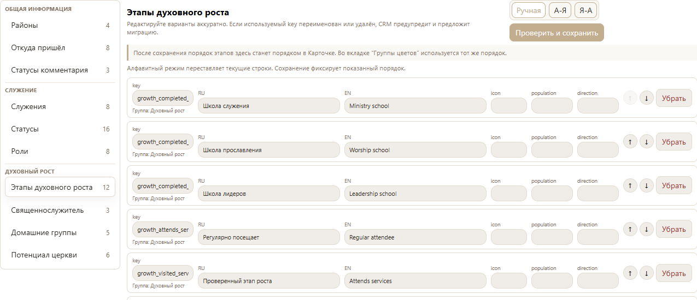
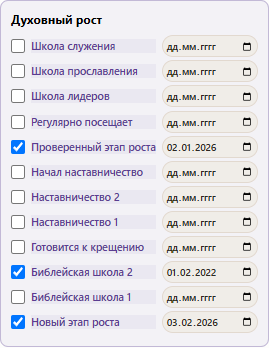

# Хроника uChurch: 9 октября 2026

## v17.11.112 — порядок этапов духовного роста

Реальные снимки браузера при полном регрессионном сценарии на изолированной
синтетической базе, 1366×768. Это локальная проверка кандидата, а не снимок
реальной базы или доказательство установки на VPS. Изображения обрезаны
по области настройки/духовного блока; содержимое не дорисовывалось.

Редактор после экспорта и повторного открытия проверенного пакета.
Первые этапы: школа служения, школа прославления, школа лидеров.

Духовный блок той же synthetic Карточки после повторного открытия.
Порядок совпадает с редактором; тестовые отметки и даты сохранены.

Проверки дополнительно покрывают ручную и алфавитную перестановку, редактор
групп, ошибку записи и повтор, новую Карточку и reload. Один снимок сам по
себе не доказывает всю проверку: результаты и границы описаны в
[заметке патча](release-v17.11.112.md) и [квитанции](release-v17.11.112-receipt.md).

## Как продолжается история

[RU история](development-history.ru.md), [EN history](development-history.en.md)
и [полный каталог](patch-history.ru.md) сохраняют прежние этапы.
Нумерационные пробелы и отсутствующие старые снимки не заполняются догадками.
Дальнейшие визуальные изменения получают дату, версию, реальные безопасные
снимки и ссылку на фактическую проверку. Исторические снимки не выдаются за
текущий интерфейс. Файлы изображений и текста восстанавливаются из GitHub.
